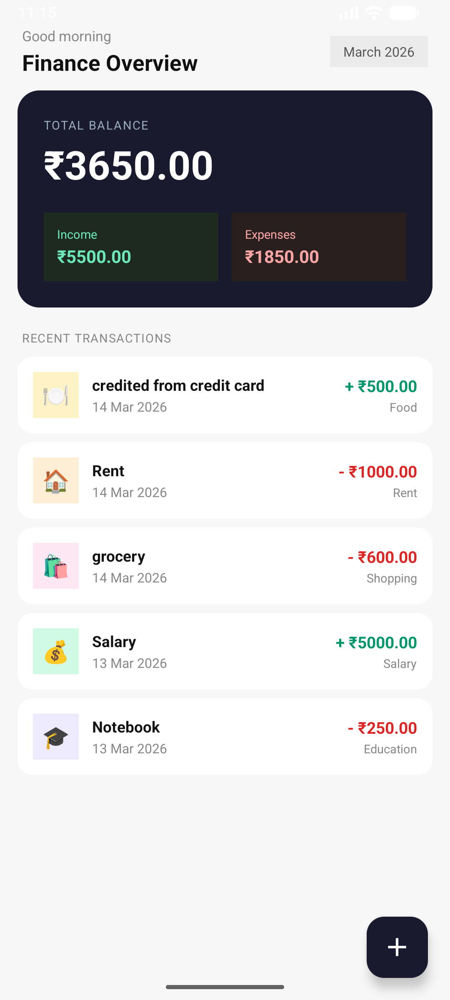
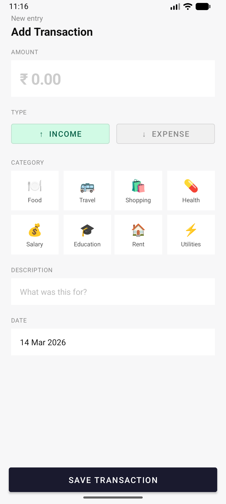

# Finance Manager App

A simple and efficient Android application to track your daily income and expenses. This app helps users manage their personal finances by providing a clear view of their balance, total income, and total expenses.

## 🚀 Features

*   **Add Transactions**: Easily record income and expense entries with descriptions, categories, amounts, and dates.
*   **Edit Transactions**: Tap any transaction to open it in an edit screen — all fields are pre-filled and can be updated.
*   **Delete Transactions**: Swipe left on any transaction to delete it, with an **Undo** option via Snackbar.
*   **Real-time Balance**: Automatically calculates and displays your current balance, total income, and total expenses.
*   **Transaction History**: View all past transactions sorted by date, with category icons for quick scanning.
*   **Category Selection**: Choose from 8 built-in categories (Food, Travel, Shopping, Health, Salary, Education, Rent, Utilities) using a visual grid.
*   **Date Picker**: Select the transaction date using a native DatePickerDialog — future dates are blocked.
*   **Persistent Storage**: Uses Room Database to ensure your data is saved locally on your device.
*   **Efficient UI**: Built with RecyclerView and ListAdapter for smooth, animated list updates.

## 🛠️ Tech Stack

*   **Language**: [Kotlin](https://kotlinlang.org/)
*   **Architecture**: MVVM (Model-View-ViewModel)
*   **Database**: [Room Persistence Library](https://developer.android.com/training/data-storage/room)
*   **Asynchronous Programming**: [Kotlin Coroutines](https://kotlinlang.org/docs/coroutines-overview.html) & [Flow](https://kotlinlang.org/docs/flow.html)
*   **UI Components**: RecyclerView, ListAdapter, FloatingActionButton, ItemTouchHelper, Snackbar, DatePickerDialog, Material Components.

## 📸 Screenshots

| Dashboard | Add Transaction |
| :---: | :---: |
|  |  |

## 🏗️ Project Structure

```
com.example.financemanager
├── data/
│   └── Transaction.kt              # Room entity
├── database/
│   ├── AppDataBase.kt              # Room database singleton
│   └── TransactionDao.kt           # Insert, Update, Delete, Query
├── repository/
│   └── TransactionRepository.kt    # Data operations layer
├── viewmodel/
│   ├── TransactionViewModel.kt     # Add, update, delete, expose flows
│   └── TransactionViewModelFactory.kt
├── adapter/
│   └── TransactionAdapter.kt       # RecyclerView adapter with onEdit & onDelete callbacks
├── MainActivity.kt                 # Dashboard — balance card, transaction list, swipe-to-delete
├── AddTransactionActivity.kt       # Add new transaction
└── EditTransactionActivity.kt      # Edit existing transaction
```

## 📋 How It Works

### Adding a Transaction
1. Tap the **+** button on the dashboard
2. Enter the amount, select Income or Expense, pick a category, optionally add a description, and choose a date
3. Tap **Save Transaction**

### Editing a Transaction
1. Tap any transaction row in the list
2. The edit screen opens with all fields pre-filled
3. Make changes and tap **Update Transaction**

### Deleting a Transaction
1. Swipe any transaction row **left**
2. The row is removed with a red delete indicator
3. Tap **UNDO** in the Snackbar within 3 seconds to restore it

## 🏁 Getting Started

1.  Clone the repository:
    ```bash
    git clone https://github.com/HannaSherine/FinanceManager.git
    ```
2.  Open the project in **Android Studio**.
3.  Build and run the app on an emulator or physical device (API 26+).

---

Developed with ❤️ using Kotlin and Jetpack.
